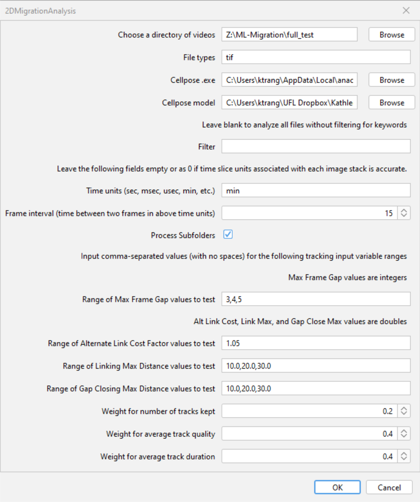

# ML-Cell-Migration
A pipeline for an automated machine learning-driven assay for robust and accessible analysis of cell migration

## Overview
This repository contains code for an [ImageJ](https://imagej.net/software/imagej/) Jython (.py) plugin for automated analysis of 2D rectangular migration assays for robust and accessible analysis of cell migration. The code is written in [Jython](https://imagej.net/scripting/jython/) and has been tested in [FIJI (FIJI Is Just ImageJ)](https://imagej.net/software/fiji/downloads) with ImageJ version 1.54j. The plugin is dependent on an installation of [Cellpose](https://github.com/MouseLand/cellpose) for segmentation before beginning the tracking process with [TrackMate](https://imagej.net/plugins/trackmate/) (tested on v7.2.1+).

Example data used for analysis is located in the **examples** folder. Shorter image sets, denoted as _small or _tiny are also provided.

## Requirements
- FIJI distribution of ImageJ
- [TrackMate](https://imagej.net/plugins/trackmate/)
- [Cellpose](https://github.com/MouseLand/cellpose)

## Contents
- [2DMigrationAnalysis.py](2DMigrationAnalysis.py): the main plugin, to be installed in FIJI for automated analysis of 2D rectangular migraiton assays for robust and accessible analysis of cell migration
- [plotFeatures.Rmd](plotFeatures.Rmd): an R markdown script for plotting means of track features, ran in chunks to plot bar graphs and calculate Cohen's d for features from track .csv files
- [alteredPlotTracks.mlx](alteredPlotTracks.mlx): a MATLAB live script to plot true track location and tracks from the origin from tracks .xml files
- track-xml-examples: contains example tracks .xml files for use with the [MATLAB live script](alteredPlotTracks.mlx) for plotting tracks, requires [importTrackMateTracks.m](https://github.com/trackmate-sc/TrackMate/blob/master/scripts/importTrackMateTracks.m) file.
- example-assay-videos: contains zipped shortened .tif image stacks for use with the main [2D migration analysis plugin](2DMigationAnalysis.py)
- img: contains image assets for the Plugin Walkthrough below

## Installation
1. Download the [2DMigrationAnalysis.py](2DMigrationAnalysis.py) file.
2. Install [FIJI (FIJI Is Just ImageJ)](https://imagej.net/software/fiji/downloads) and [Cellpose](https://github.com/MouseLand/cellpose). If necessary, Cellpose can be installed locally without a conda environment. Ensure you have Python installed first, though.
3. Open FIJI and go to **Plugins >> Install** or hit **Ctrl + Shift + M**. FIJI will prompt you for a file to install. Select [2DMigrationAnalysis.py](2DMigrationAnalysis.py), then select a location within the second file prompt to save the plugin. If you save it where FIJI automatically opens, it will appear under **Plugins >> 2DMigrationAnalysis**. Otherwise, it will appear elsewhere. For further documentation, look [here](https://imagej.net/plugins/).
4. You will then be prompted to restart FIJI. Do that, then ensure that you can find the 2DMigrationAnalysis plugin by utilizing FIJI's search bar.

FIJI will tell you where the plugin can be found and allow you to run it from the search results.
You're done! (With installation), feel free to move the file around in the Fiji.app files if the location is inconvenient to you.

## Plugin Walkthrough
1. When running the program, the following dialog will appear:

From top to bottom, these are the requested inputs:
**Bold names indicate required fields**
- **Choose a directory of videos**: Hit _Browse_ to open a file explorer dialog and select a directory containing videos to be segmented.
- File types: add the file extensions you want to be included in the batch process. Note that single-frame .tif files will likely throw an error in TrackMate
- **Cellpose .exe**: Hit _Browse_ to open a file explorer dialog and select the location of the python.exe or cellpose.exe. If you have multiple installations of python, ensure you select the one linked to cellpose. It may be best to have the conda environment if you intend to have multiple installations of python.
- **Cellpose model**: Hit _Browse_ and select a cellpose segmenetation model
- Filter: add a words to filter for, this will only include files with the filtered words in their names
- Time units: input units if you are uncertain if the time units associated with your image are correct
- Frame interval: input an integer concerning the amount of above time units between each frame. Leave as 0 or empty if your time slice units are correct
- Process Subfolders: check if you want the plugin to check all subfolders for files to process
  The following 4 values are with regards to tracking input variables and will be the values tested in the TrackMate Linear Assignment Problem tracking algorithm. They **must** be entered as comma-separated values with **no spaces in between**.
- **Range of Max Frame Gap values to test**: list of integers, how many frames TrackMate will attempt to connect two spots
- **Range of Alternate Link Cost Factor values to test**: list of doubles, essentially how much TrackMate will consider alternative paths
- **Range of Linking Max Distance values to test**: list of doubles, how far (in image space units) TrackMate will attempt to connect two tracks
- **Range of Gap Closing Max Distance values to test**: list of doubles, how far (in image space units) TrackMate will attempt to connect two spots
- **Weight for number of tracks kept**: a double, weight for the # of tracks kept variable in the tracking quality equation
- **weight for average track quality**: a double, weight for the average track quality variable in the tracking quality equation
- **Weight for average track duration**: a double, weight for the average track duration variable in the tracking quality equation
Settings will be saved between runs.
Hit **OK** once finished.
2. The plugin will open 3 windows:
  - Log: Will contain information about what the plugin is doing and what is being tested or tracked, but spot detection has no progress bar, so you may be waiting for a while if you have a large video or many cells in said video

  - Tracking_Quality: This table will hold the results of tracking quality calculations and be returned to the user in the form of a .csv file in the folder of the first image used to determine ideal tracking input variables.
  - First image in the video directory
3. The plugin will follow the following loop to segment, remove, and calculate to determine the prime tracking input variables for the following videos in the batch process. Below are some signposts to look out for in case you're attempting to figure out where the plugin is now.

Between videos the plugin will create basic overlay tiffs of completed tracking

Once all input variable combinations have been tested, the Tracking_Quality table will update with tracking_quality values

Outputs in log to tell you it's saved a .csv of the tracking quality results

Once finished, the Log will spit out a list of what it's created and what it's generally done
4. The following outputs are created at the end of the process:
- ...spots.csv: contains spot feature data from optimized tracking for the image it's named after
- ...edges.csv: contains edge feature data from optimized tracking for the image it's named after
- ...tracks.csv: contains tracks feature data from optimized tracking for the image it's named after
- ...trackingQuality.csv: contains the results from the Tracking_Quality table, only created for the first video in every batch
- ...Tracks.xml: contains tracks for use with the [MATLAB live script](alteredPlotTracks.mlx) for plotting tracks
- ....xml: TrackMate model file, linked to the image it's named after, can be opened in TrackMate proper (**Plugins >> Tracking >> Load a TrackMate File**)
